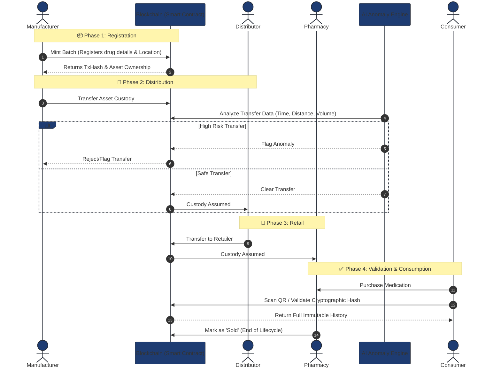

<div align="center">

# 🏥 SecureRxChain

### **Blockchain-Based Drug Supply Chain & Counterfeit Medicine Prevention System**

[](https://github.com/manikantbindass/SecureRxChain-Blockchain-Based-Drug-Supply-Chain-Counterfeit-Medicine-Prevention-System/actions/workflows/ci-cd.yml)
[](https://opensource.org/licenses/MIT)
[](https://soliditylang.org/)
[](https://nodejs.org/)
[](https://reactjs.org/)
[](https://www.python.org/)

*A decentralized platform that leverages blockchain technology, QR verification, and AI-powered anomaly detection to ensure end-to-end pharmaceutical traceability, prevent counterfeit medicines, and enforce regulatory compliance.*

[🚀 Demo](#demo) •
[📖 Documentation](#documentation) •
[🏗️ Architecture](#architecture) •
[⚡ Quick Start](#quick-start) •
[🤝 Contributing](#contributing)

</div>

---

## 📋 Table of Contents

- [Overview](#-overview)
- [Key Features](#-key-features)
- [Project Architecture](#-project-architecture)
- [System Workflow](#-system-workflow)
- [Quick Start](#-quick-start)
  - [Backend Setup](#backend-setup)
  - [Frontend Setup](#frontend-setup)
  - [Blockchain Deployment](#blockchain-deployment)
- [CI/CD Pipeline](#-cicd-pipeline)
- [License](#-license)

---

## 🎯 Overview

**SecureRxChain** is an enterprise-grade blockchain platform designed to confidently combat the counterfeit drug industry. By establishing an immutable, entirely transparent supply chain tracking mechanism from manufacturer to consumer, this platform ensures validation, traceability, and accountability at every single step of the supply chain.

### 🛑 The Problem: The Counterfeit Drug Crisis
The World Health Organization (WHO) estimates that **1 in 10 medical products** circulating in low- and middle-income countries is either substandard or falsified. This leads to:
- **Severe Health Risks:** Patients consuming ineffective or toxic medications.
- **Economic Loss:** The pharmaceutical industry loses an estimated **$200 billion annually** to counterfeit drugs.
- **Supply Chain Opacity:** Lack of a unified tracking system makes it impossible to locate the origin of compromised batches during recalls.

### 💡 The Solution: SecureRxChain
SecureRxChain permanently solves these challenges by combining three cutting-edge technologies into a single, cohesive ecosystem:
1. **Blockchain Immutability:** Every movement of a drug batch is recorded on a Smart Contract. Once logged, the record cannot be altered, forged, or deleted. 
2. **AI-Powered Anomaly Detection:** An integrated AI layer uses Machine Learning (Isolation Forests) to analyze transfer times, locations, and batch distances to flag suspicious supply chain behavior instantly.
3. **Consumer Verification:** End consumers can scan a QR code upon purchase to verify the cryptographic signature and entire lifecycle history of their medication.

### 📊 System Workflow & Data Flow Architecture

Below is a detailed Mermaid diagram illustrating the flow of a medical batch from creation to the end consumer, emphasizing the AI validation and Blockchain state changes.



---

## 🔥 Key Features

### 🔒 Unbreakable Blockchain Core
- **Smart Contracts**: Rigorous Solidity-based execution handling roles, transfers, and identity securely.
- **Role-Based Access Control**: Manufacturer, Distributor, and Pharmacy roles automatically federated via private keys.
- **Tamper-Proof Transactions**: Permanent and indisputable ledger of every medication batch.

### 📱 Modern User Interfaces
- **React/Vite Dashboards**: Ultra-fast and highly responsive user interfaces customized for each supply chain role.
- **Transfer Capabilities**: Unified dashboards guaranteeing secure handover of assets between parties.
- **Instant Metamask-Free Wallets**: Automatic smart-wallet derivation ensuring non-technical personnel can operate on-chain seamlessly.

---

## 🏗️ Project Architecture

The SecureRxChain project is composed of three major architectural pillars designed for loose coupling and high scalability:

### 1. `frontend/` (React + Vite)
Contains the modern web interfaces. It features separated portals for `Manufacturers`, `Distributors`, and `Pharmacies`. It integrates exclusively with the Backend API and does not directly hit the blockchain, ensuring secure proxy handling of private keys.

### 2. `backend/` (Node.js + Express)
The nerve center of the application. It receives standard API requests from the frontend, maps them to Ethereum blockchain operations using `ethers.js`, and holds an off-chain MongoDB database for fast querying and caching.

### 3. `blockchain/` (Hardhat + Solidity)
The Web3 layer. Houses the `DrugRegistry.sol` smart contract which defines the strict state machine of a drug batch (`Manufactured` → `In Transit` → `Distributed` → `Sold`).

---

## 🔄 System Workflow

1. **Minting:** The **Manufacturer** registers a new drug batch. A unique blockchain transaction is fired, assigning ownership exclusively to the Manufacturer's wallet.
2. **Distribution:** The **Manufacturer** triggers an on-chain transfer transferring custody of the batch to a verified **Distributor**.
3. **Retail:** The **Distributor** passes the batch directly to a **Pharmacy**, securing the end-to-end movement.
4. **Consumer:** The drug is marked as `Sold`, permanently rendering it ineligible for any further transfers on the blockchain to prevent re-packaging and counterfeit distribution.

---

## ⚡ Quick Start

### AI Risk Engine Setup (Required)
The Node.js backend relies on the Python Machine Learning service to generate real-time 0-100 Risk Scores for the Consumer Dashboard based on batch age and transfer hop counts.

```bash
cd ai
pip install -r requirements.txt
python risk_api.py
```
The AI service will run on port `5002`. Ensure this is running concurrently with the backend API.

### Backend Setup
```bash
cd backend
npm install
npm start
```
The API server will run securely on port `5000`. Ensure your local `.env` is configured stringently.

### Frontend Setup
```bash
cd frontend
npm install
npm run dev
```
The UI dashboard will render on port `5173`.

### Blockchain Deployment (Local)
```bash
cd blockchain
npm install
npx hardhat node
# In a new terminal window:
npx hardhat run scripts/deploy.js --network localhost
```

---

## 🚀 CI/CD Pipeline

The project relies on robust **GitHub Actions** located in `.github/workflows/ci-cd.yml`.
Upon every push and pull request to the `main` branch, the CI pipeline automatically:
- 🔗 Installs dependencies and runs hardhat compilation validations for Smart Contracts.
- 🖥️ Installs dependencies and lintings for the Backend Node.js Environment.
- ⚛️ Executes a continuous deployment staging build for the Frontend using Vite.

This rigorously enforces that `frontend/`, `backend/`, and `blockchain/` remain fundamentally stable at all times.

---

## 📄 License
This project is securely licensed under the MIT License - see the `LICENSE` file for details.
